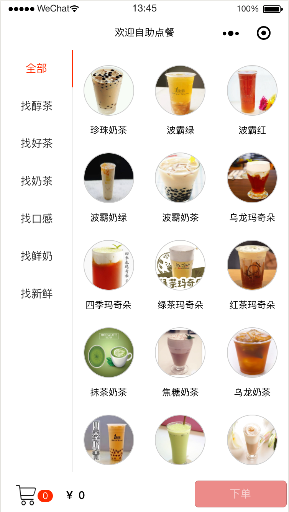
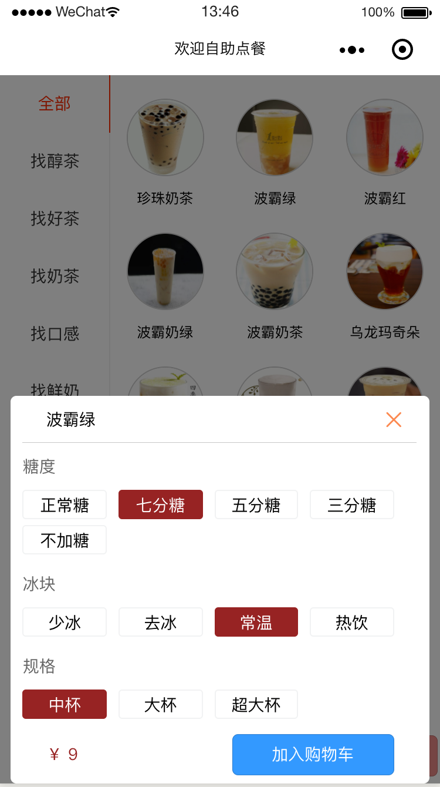
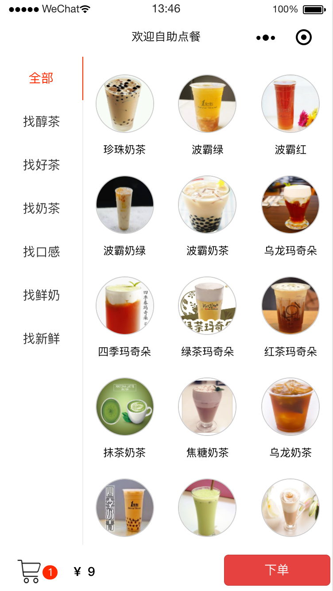
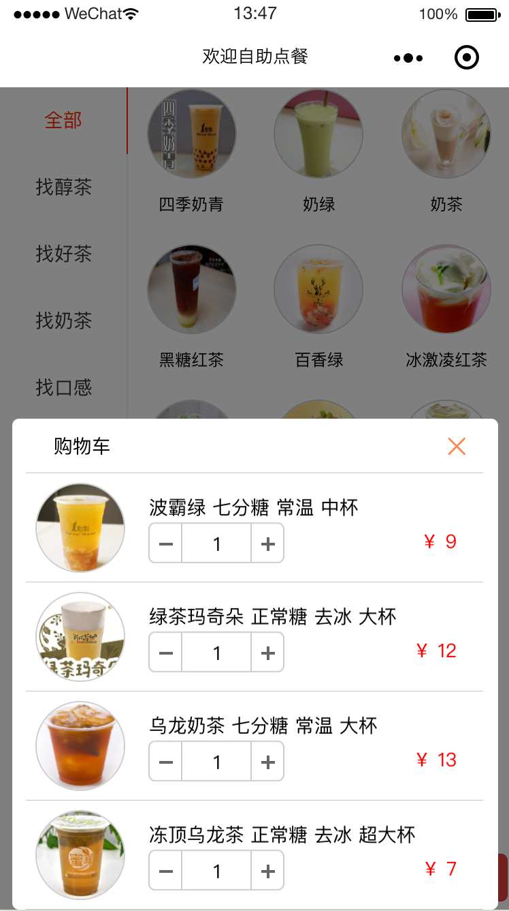
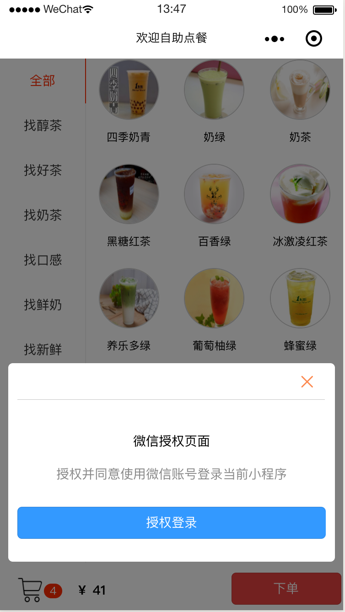
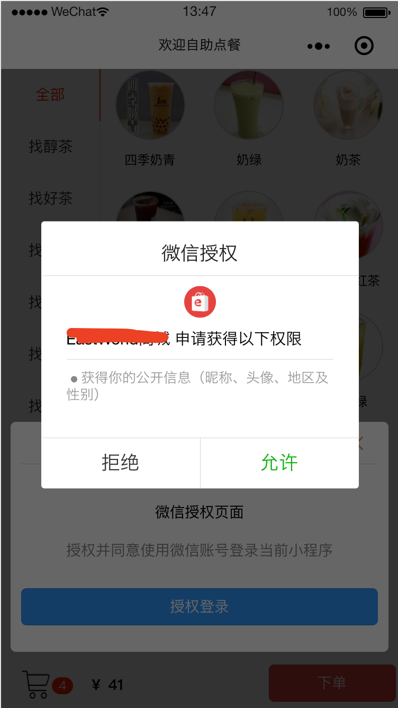
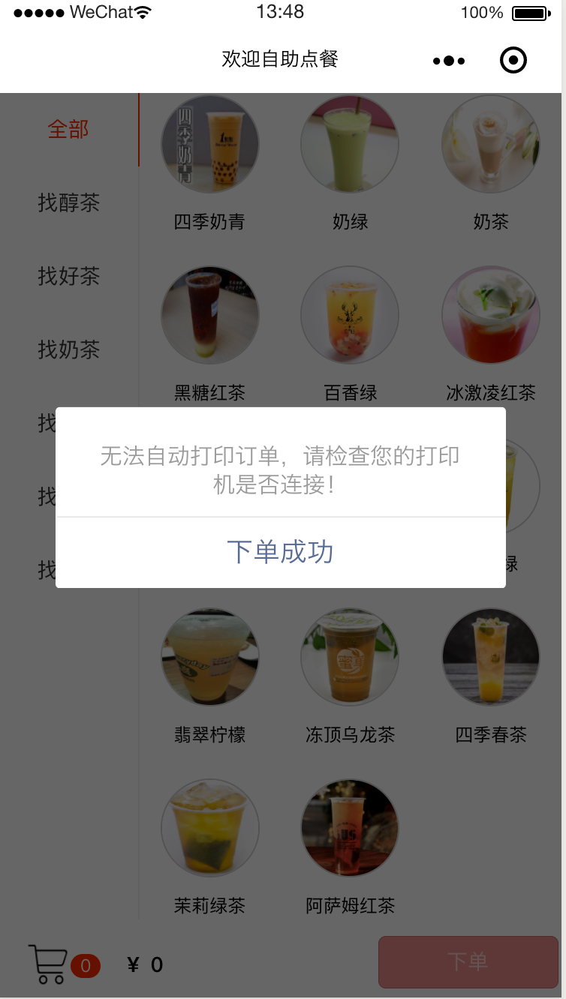

# 微信小程序点餐助手
特点：点餐小程序，点单自动出单，点餐自动打印

本项目有2个设计目标：

* 商家可以在手机上实现快速点单、下单、打印机自动出票，提高整个点餐流程提升效率； 
* 用户可以通过该小程序实现自助点单、下单、在线支付后，联动商家打印机自动出票，提升用餐体验；

本项目交流QQ群 315181914 欢迎大家加入交流

>更加欢迎会开发的您一起加入，完善本项目

## 开发框架
基于[Touch WX](http://www.wetouch.net/touchwx_doc/quickstart/)框架，可以点击查看

[开发环境安装](http://www.wetouch.net/touchwx_doc/quickstart/begin/ide)

## 效果截图

## 使用教程
1. 修改 config.js 文件， subDomain 改为你自己的域名
    > 你可以 [免费开通后台账号](https://www.it120.cc/)
2. 登录你的[小程序后台](https://mp.weixin.qq.com)，[设置小程序合法服务器域名](https://www.it120.cc/info/faq/10469)，修改后需要重启小程序开发工具才能生效
3. [登录后台](https://www.it120.cc/user)，左侧菜单，微信设置填写您的小程序 appid 和 secret

## 运行小程序
1. npm install
2. tui dev
3. 用小程序打开项目即可浏览效果，项目路径指向本项目的 dist 文件夹